# Logstash Worker 스레드 벤치마크 보고서

---

## 1. 개요

### 1.1 목적

본 보고서는 10분치 방화벽 로그(약 100만 건, 550MB)를 처리하는 Standalone ELK 파이프라인을 구축하고, Logstash Worker 수를 `1 → 4 → 8`로 변경하면서 처리 속도, 시스템 리소스, Aggregate 결과의 정합성을 비교한 벤치마크 보고서이다.

### 1.2 주요 결과 요약

- Worker 1 → 4로 늘렸을 때 유입 처리 시간이 **210초 → 70초로 3배 빨라졌으나**, 4 → 8에서는 70초 → 60초로 개선폭이 크게 줄었다.
- Worker 4와 8의 **End-to-End 시간은 모두 90초로 같았다.** 유입 시간은 줄었지만 그만큼 잔여 처리 구간이 늘어난 결과다 — 자세한 내용은 6.2절 참고.
- CPU, Disk, Memory, JVM 어느 자원도 한계에 도달하지 않았다. 처리량이 정체된 원인은 하드웨어가 아니라 **aggregate 필터가 통계함을 한 번에 하나씩만 쓸 수 있게 막아둔 구조**에 있었다.
- Worker 수가 늘어날수록 **20초 윈도우의 이벤트 밀도 분포가 달라지는 현상**이 관측되었다. aggregate 필터 공식 문서에서 Worker를 1로 고정하도록 권고하는 이유를 실측으로 확인하였다.
- Aggregate 병합을 통해 이벤트 건수를 약 **44.7~46.4% 축소**할 수 있었고, `sum(event_count)`는 전 케이스에서 동일하게 보존되었다.

### 1.3 제출물 구성

```
.
├── README.md                          # 본 보고서
├── 1_pipeline/
│   └── firewall_agg.conf              # Logstash 파이프라인 코드
├── 2_elk_config/
│   ├── docker-compose.yml             # 컨테이너 구성 및 자원 할당
│   │                                   #   (Elasticsearch config 포함: environment 블록의
│   │                                   #    discovery.type, ES_JAVA_OPTS, cpuset, memory 등 —
│   │                                   #    별도 elasticsearch.yml 없이 환경변수로만 구성)
│   ├── logstash/
│   │   ├── logstash.yml               # Logstash 설정
│   │   └── es_template.json           # Elasticsearch 인덱스 템플릿
│   ├── metricbeat/
│   │   ├── metricbeat.yml             # Metricbeat 전역 설정
│   │   └── modules.d/
│   │       ├── docker.yml             # Docker 모듈 설정
│   │       └── logstash.yml           # Logstash 모듈 설정
│   └── logs/
│       └── invalid_format.log         # 형식 검증 실패로 격리된 로그 (4건)
├── 3_aggregate_output/
│   └── firewall_agg_result.csv.gz     # Worker 1 기준 agg 결과물 (552,904행)
├── 4_raw_metrics/                     # 벤치마크 원본 시계열 CSV
│   ├── worker{1,4,8}_eps.csv          # events.in / events.out
│   ├── worker{1,4,8}_logstash.csv     # Logstash CPU
│   ├── worker{1,4,8}_log_mem.csv      # Logstash Memory
│   ├── worker{1,4,8}_jvm_chart.csv    # JVM Heap
│   ├── worker{1,4,8}_disk.csv         # Logstash Disk I/O
│   └── worker{1,4,8}_es.csv           # Elasticsearch Disk Write / CPU
└── image/                             # 벤치마크 그래프 (21장)
```

> `4_raw_metrics/`는 본 보고서의 모든 수치를 산출한 원본 데이터이다. Kibana Lens에서 10초 버킷, Counter rate(per second)로 추출하였으며, 이 CSV만으로 보고서의 전 수치를 재현할 수 있다.

---

## 2. 테스트 환경

### 2.1 하드웨어 및 OS

| 항목 | 사양 |
|---|---|
| CPU | AMD Ryzen 5 5600X (6 Core / 12 Thread) |
| Storage | NVMe M.2 SSD |
| Host OS | Windows + WSL2 |
| WSL2 할당 | `processors=10`, `memory=16GB`, `swap=0` |
| Container Runtime | Docker (WSL2 backend) |
| Elastic Stack | 8.11.0 |

본 CPU는 12개 논리 스레드를 제공하며, WSL2에 10개를 노출하고 그중 8개를 Logstash에 할당하였다. Worker 8 테스트는 별도 조정 없이 수행하였다.

### 2.2 컨테이너 자원 할당

Logstash와 나머지 서비스가 CPU를 두고 경합하지 않도록, `cpuset`으로 코어를 나누어 배타적으로 할당하였다.

| 서비스 | cpuset | CPU 할당 | Memory 할당 | JVM |
|---|:---:|:---:|:---:|:---:|
| **logstash** | **`0-7`** (전용) | 8.0 | 8G | `-Xms2g -Xmx2g` |
| elasticsearch | `8-9` | 1.5 | 4G | `-Xms2g -Xmx2g` |
| kibana | `8-9` | 0.3 | 1G | — |
| metricbeat | `8-9` | 0.2 | 1G | — |

### 2.3 아키텍처

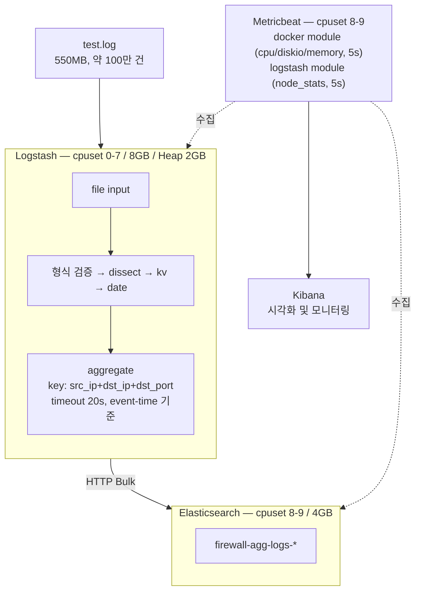

**선택항목 구현 사항:**

- **Logstash Centralized Pipeline Management:** `xpack.management.enabled: true`를 설정하여, Kibana에서 파이프라인을 관리하고 Worker 수를 변경할 수 있도록 구성하였다. `pipeline.workers` 값은 별도 config 파일이 아니라 Kibana → Stack Management → Logstash Pipelines에서 직접 변경하며, `firewall_agg` 파이프라인의 이 값을 1 / 4 / 8로 바꾼 뒤 재시작하여 각 테스트를 수행하였다.
- **Metricbeat 연동:** `docker` 모듈과 `logstash` 모듈을 함께 사용하여, 컨테이너 레벨 지표(CPU/Mem/Disk)와 파이프라인 내부 지표(events.in/out, JVM Heap)를 동시에 수집하였다.
- **오류 감지 및 사후 모니터링 방안:** 파싱 단계별로 실패 원인을 태깅하고 별도 파일로 격리하여, 형식에 맞지 않는 로그가 aggregate 단계로 유입되지 않도록 구성하였다. 상세 내용은 5.2절 참고.

---

## 3. 측정 방법론

### 3.1 측정 대상

과제의 `CPU / Mem / JVM / IO`에서 `Mem`과 `JVM`이 함께 나열된 점을 보면, 하나의 JVM 프로세스를 OS 레벨과 런타임 레벨로 나눠 보라는 의미로 판단하였다. 따라서 주 측정 대상은 **Logstash 컨테이너/프로세스**이다.

보조적으로 Elasticsearch 컨테이너의 CPU와 Disk Write도 함께 수집하여, 3개 테스트에서 뒤이어 데이터를 받는 Elasticsearch 쪽 상태가 동일했는지 확인하였다.

`IO`는 본 벤치마크의 독립 변인인 `pipeline.workers`가 디스크 읽기 속도와 직접 관련이 있다고 판단하여 **Disk I/O**로 측정하였다. Logstash → Elasticsearch 전송량은 `events.out` 건수로 확인하였다.

### 3.2 수집 경로 및 집계 방식

| 지표 | 모듈 | 필드 | 집계 |
|---|---|---|---|
| CPU | docker | `docker.cpu.total.pct` | Average / Max |
| Memory | docker | `docker.memory.usage.total`, `.pct` | Average / Max |
| Disk I/O | docker | `docker.diskio.read.bytes`, `.write.bytes` | Counter rate (per second) |
| JVM Heap | logstash | `logstash.node.stats.jvm.mem.heap_used_in_bytes` | Average / Max |
| Events In/Out | logstash | `logstash.node.stats.events.in`, `.out` | Counter rate (per second) |

- **수집 주기:** Metricbeat `period: 5s`
- **Kibana 시각화 버킷:** 10초 고정 (Auto로 두면 테스트 길이에 따라 버킷 크기가 바뀌므로)
- **Counter rate 처리:** `diskio`, `events` 필드는 컨테이너 시작 이후 누적값이므로, Kibana에서 `Counter rate` + `Normalize by unit: per second`를 적용하여 초당 값으로 변환
- **그래프:** 모든 그래프는 `4_raw_metrics/`의 CSV에서 렌더링하였으며, 같은 지표는 3개 케이스의 Y축 범위를 맞췄다. 그래프의 파란 음영은 유입 구간, 주황 음영은 유입이 끝난 뒤 남은 데이터가 마저 빠져나가는 구간을 나타낸다.

### 3.3 EPS 정의

테스트 시간이 60~240초 범위이므로, 평균 EPS의 의미가 정의에 따라 달라진다. 본 보고서에서는 두 가지를 병기한다.

```
실효 EPS      = 총 이벤트 수 ÷ (유입 시작 ~ 잔여 처리 구간이 끝날 때까지의 전체 시간)
                → 잔여 처리 구간의 대기 시간까지 포함되어 다소 낮게 나온다
활성구간 EPS  = 총 이벤트 수 ÷ (로그가 실제로 들어오고 있던 시간만, 잔여 처리 구간 제외)
                → 파이프라인의 순수한 처리 속도라 더 높게 나온다
```

1 minute EPS는 10초 단위 값을 6개씩(=60초 분량) 묶어 평균을 낸 뒤, 10초씩 밀어가며 반복 계산하는 방식으로 산출하였다. 이때 범위는 유입 구간뿐 아니라 잔여 처리 구간까지 포함한 총 처리 시간이며, 가장 짧은 Worker 8(총 90초)도 10초씩 9조각이 나와 60초짜리 창을 4번 밀 수 있었다. 유입 구간(60초, 6조각)만 썼다면 창을 밀 자리가 없어 값이 1개만 나왔을 것이다.

---

## 4. 벤치마크 변인 통제

### 4.1 인프라 자원 고정

`.wslconfig`로 WSL2에 노출되는 자원을 고정하였다.

```ini
[wsl2]
processors=10
memory=16GB
swap=0
localhostForwarding=true
```

`swap=0`으로 스왑을 비활성화하고, JVM Heap은 `-Xms2g -Xmx2g`로 최소·최대를 같게 설정하여 런타임 중 힙 재할당이 일어나지 않도록 하였다.

### 4.2 OS 페이지 캐시 초기화

반복 테스트 시 550MB 로그 파일이 OS 페이지 캐시에 남아 있으면, Logstash가 디스크 대신 메모리에서 파일을 읽게 되어 Disk Read 수치가 0에 가깝게 왜곡된다. 이를 방지하기 위해 매 테스트 전 아래 명령을 실행하였다.

```bash
sudo vmtouch -e test.log                              # 대상 파일 캐시 제거
sudo sync; echo 3 | sudo tee /proc/sys/vm/drop_caches # 전체 페이지 캐시 초기화
```

결과적으로 3개 테스트 모두에서 **Disk Read 총량이 552.1~552.2 MB**로, 원본 파일 크기(≈550MB)와 일치하여 캐시 없이 디스크에서 전량을 읽었음을 확인하였다.

> 다만 WSL2 게스트에서 `drop_caches`를 실행해도 Windows 호스트의 파일시스템 캐시까지 제거되지는 않는다. 이 점은 3개 테스트에 동일하게 적용되는 조건이므로 상대 비교에는 영향을 주지 않는다.

### 4.3 Elasticsearch I/O 간섭 최소화

인덱싱 refresh가 자주 발생하면 Elasticsearch에 세그먼트 생성 부하가 생긴다. 이 부하를 줄이기 위해 인덱스 템플릿에서 refresh를 꺼두었다.

```json
{
  "index_patterns": ["firewall-agg-logs-*"],
  "template": {
    "settings": {
      "index.refresh_interval": "-1",
      "index.number_of_replicas": 0,
      "index.number_of_shards": 1
    }
  }
}
```

이 설정은 실 운영과 다른 조건이므로, 본 결과의 Out EPS나 ES Disk Write를 운영 환경에 그대로 대입할 수 없다는 점을 한계로 남긴다.

### 4.4 단계적 서비스 안정화

Elasticsearch → Kibana → Logstash → Metricbeat 순으로 서비스를 올리고, 각 서비스의 초기 부하가 안정된 이후 로그를 주입하였다. CPU 시계열을 보면, 유입 시작 직전 구간의 CPU가 1~9% 수준으로 낮은 것을 확인할 수 있다(6.3절 그래프 참고).

---

## 5. 파이프라인 구현

### 5.1 파싱 흐름

입력 로그는 Syslog(RFC 5424) 헤더 + Key-Value 본문 구조의 방화벽 로그이다. 아래 5단계로 처리한다.

```
입력 예시:
<14>1 2026-02-04T00:00:00.042140Z [fw4_deny] [10.0.0.255] start_time="..." end_time="..."
src_ip=10.0.0.134 src_port=60427 dst_ip=100.100.100.106 dst_port=443 protocol=6 ...
```

| 단계 | 필터 | 처리 |
|:---:|---|---|
| 1 | 조건문 | Syslog 형식(`^<\d+>`) 여부 검증 |
| 2 | `dissect` | 헤더 분해 → syslog 필드, log_action, device_ip, kv_data |
| 3 | `kv` | 본문 Key-Value 파싱 |
| 4 | `mutate` | port/bytes/packets 정수 변환 + 음수 검증 |
| 5 | `date` → `aggregate` | `end_time`을 `@timestamp`로 파싱 후 20초 윈도우 병합 |

`grok` 대신 `dissect`를 사용한 이유는, 본 로그의 구분자가 고정되어 있어 정규식이 불필요하고 CPU 부하도 적기 때문이다.

### 5.2 오류 감지 및 격리

파이프라인은 각 파싱 단계마다 실패를 태깅하고, 원인별로 별도 파일에 격리하도록 구성하였다. 오류 데이터가 aggregate로 유입되는 것을 막기 위함이다.

```ruby
# 형식 검증
if [message] !~ /^<\d+>/ { mutate { add_tag => ["_error_format", "_error"] } }

# 파싱 단계별 실패 태깅
dissect { ... tag_on_failure => ["_error_dissect", "_error"] }
kv      { ... tag_on_failure => ["_error_kv",      "_error"] }
if [bytes_total] < 0 or [packets_total] < 0 {
  mutate { add_tag => ["_error_data", "_error"] }
}
```

```ruby
# 원인별 격리 출력
output {
  if      "_error_format"  in [tags] { file { path => ".../invalid_format.log"  } }
  else if "_error_dissect" in [tags] { file { path => ".../failed_dissect.log"  } }
  else if "_error_kv"      in [tags] { file { path => ".../failed_kv.log"       } }
  else if "_error_data"    in [tags] { file { path => ".../invalid_data.log"    } }
  else if "aggregated"     in [tags] { elasticsearch { ... } }
}
```

**격리 결과**

| 태그 | 건수 |
|---|---:|
| `_error_format` | **4** |
| `_error_dissect` / `_error_kv` / `_error_data` | 각 0 |

정상 형식의 로그는 **전량 파싱 오류 없이 처리**되었다.

**격리된 4건의 원인 — 입력 파일의 tar 아카이브 메타데이터 혼입**

제공된 로그 파일은 확장자가 `.xz`로만 표시되어 있었지만, 실제 내용물은 tar로 먼저 묶은 뒤 xz로 압축한 이중 구조였다. 확장자만 보고 xz 압축만 해제했더니 tar 아카이브는 풀리지 않은 채 그대로 남았고, 그 tar 헤더가 로그 라인으로 읽힌 것이다.

```
generated_forti_logs.xz            ← 확장자에는 .xz만 표시됨
   │
   ├─ xz -d 만 수행        →  .tar (내부는 여전히 tar 아카이브, 헤더 혼입) → 1,000,003 라인  ← 본 벤치마크 입력
   └─ tar -xJf 로 완전 해제 →  .txt (순수 로그)                          → 1,000,000 라인  ← 별도 검증 완료
```

| # | 격리된 내용 | 정체 |
|:---:|---|---|
| 1 | `._generated_forti_logs.txt` + `ustar` + `Mac OS X` | AppleDouble 리소스 포크 + tar 헤더 |
| 2 | tar 헤더 블록 + 실제 로그 1건이 결합된 라인 | tar 헤더 |
| 3 | `SCHILY.xattr.com.apple.provenance=...` | PAX 확장 헤더 |
| 4 | `LIBARCHIVE.xattr.com.apple.provenance=...` | PAX 확장 헤더 |

`tar -xJf`로 완전 해제한 파일이 정확히 **1,000,000 라인**임을 별도 확인하였다. 즉 원본 데이터 자체에는 문제가 없으며, 입력 파일 준비 과정에서 발생한 것이다.

이 4건 중 3건(#1, #3, #4)은 완전 해제한 파일에는 **아예 존재하지 않는** 순수 아카이브 메타데이터였고, 나머지 1건(#2)만 tar 헤더 블록 안에 **실제 로그 1건이 함께 섞여 있던** 경우였다. 즉 실질적으로 격리된 정상 로그는 #2 안에 포함된 1건뿐이다.

**벤치마크에 미치는 영향:** tar 헤더는 약 3KB로 전체 550MB의 0.0006%이며, 3개 테스트가 같은 입력을 사용했으므로 Worker 간 비교에는 영향이 없다. `sum(event_count) = 999,999`가 3케이스 전부 일치하므로 Aggregate 정합성에도 문제가 없다.

> **파이프라인 관점에서 보면**, 1단계의 형식 검증(`^<\d+>`)이 tar 헤더를 파싱 시도 전에 전량 걸러냈다는 점이 중요하다. 이 검증이 없었다면 바이너리 문자열이 `dissect`/`kv` 단계로 들어가 예외를 발생시키거나, 잘못된 필드로 파싱되어 통계를 오염시켰을 가능성이 있다.

### 5.3 Aggregate 설정

```ruby
aggregate {
  task_id => "%{src_ip}_%{dst_ip}_%{dst_port}"     # 필수: 3-tuple key
  timeout => 20                                      # 필수: 20초 타임아웃
  timeout_timestamp_field => "@timestamp"            # 필수: event-time 기준

  timeout_tags => ['aggregated']
  push_map_as_event_on_timeout => true

  code => "
    map['src_ip']  ||= event.get('src_ip')
    map['dst_ip']  ||= event.get('dst_ip')
    map['dst_port']||= event.get('dst_port')
    map['protocol']||= event.get('protocol')
    map['action']  ||= event.get('log_action')

    map['first_start_time'] ||= event.get('start_time')
    map['last_end_time']      = event.get('end_time')

    map['sum_bytes_total']   ||= 0
    map['sum_bytes_total']    += event.get('bytes_total').to_i
    map['sum_packets_total'] ||= 0
    map['sum_packets_total']  += event.get('packets_total').to_i
    map['event_count']       ||= 0
    map['event_count']        += 1
  "
}

# 집계에 쓰인 원본 개별 로그는 폐기 (통계 이벤트만 남김)
if "_error" not in [tags] and "aggregated" not in [tags] { drop {} }
```

**`timeout_timestamp_field`를 지정한 이유:** 이 옵션이 없으면 aggregate는 시스템 시계를 기준으로 만료를 판정한다. 이 경우 Logstash가 로그를 빨리 처리하면 같은 로그라도 윈도우가 달라질 수 있어 재현성이 떨어진다. `@timestamp`(= 로그의 `end_time`)를 기준 시계로 지정하면, 처리 속도와 무관하게 **로그 내부의 시간축을 기준으로 20초 윈도우가 구성**된다.

---

## 6. 벤치마크 결과

### 6.1 종합 지표표

| 분류 | 항목 | **Worker 1** | **Worker 4** | **Worker 8** |
|:---|:---|---:|---:|---:|
| **처리 속도** | 유입 시작 시각 | 14:51:00 | 16:01:50 | 16:23:00 |
| | 유입 종료 시각 | 14:54:20 | 16:02:50 | 16:23:50 |
| | 인덱싱 종료 시각 | 14:54:50 | 16:03:10 | 16:24:20 |
| | **유입 소요 시간** | **210초** | **70초** | **60초** |
| | 잔여 처리 구간 | 30초 | 20초 | 30초 |
| | **총 소요 시간** | **240초** | **90초** | **90초** |
| | 실효 In EPS (총 처리 시간 기준) | 4,167 /s | 11,111 /s | 11,111 /s |
| | 활성구간 In EPS | 4,762 /s | 14,286 /s | 16,667 /s |
| | 1min In EPS — Avg / Max | 4,374 / 5,469 | 11,785 / 16,633 | 12,947 / 18,516 |
| | 실효 Out EPS (총 처리 시간 기준) | 2,304 /s | 6,118 /s | 5,953 /s |
| | 1min Out EPS — Avg / Max | 2,405 / 3,026 | 6,441 / 9,133 | 6,885 / 9,859 |
| **CPU** | 유입구간 평균 | 94.42 % | 255.04 % | 356.26 % |
| | 전체 구간 평균 | 82.70 % | 198.51 % | 237.87 % |
| | 최대 | 129.20 % | 315.55 % | 455.60 % |
| | 워커당 활용률 | 94.4 % | 63.8 % | 44.5 % |
| | CPU 총 작업량 | 198.5 core·s | 178.7 core·s | 214.1 core·s |
| **Memory** | usage 평균 / 최대 | 1,896.6 / 1,952.4 MB | 1,874.0 / 1,950.7 MB | 1,923.4 / 2,020.8 MB |
| | 사용률 (%, 분모 8GiB) | 23.14 % / 23.80 % | 22.86 % / 23.80 % | 23.47 % / 24.70 % |
| **JVM** | Heap 평균 / 최대 | 860.7 / 1,321.9 MB | 791.0 / 1,055.4 MB | 1,005.7 / 1,279.6 MB |
| **Disk I/O** | Read Peak / 총량 (LS) | 4.00 MB/s / 552.1 MB | 13.60 MB/s / 552.2 MB | 12.80 MB/s / 552.2 MB |
| | Write (LS) | 0.00 MB/s | 0.00 MB/s | 0.00 MB/s |
| | Write Peak / 총량 (ES) | 3.82 MB/s / 403.1 MB | 8.22 MB/s / 357.6 MB | 7.14 MB/s / 348.0 MB |
| | ES CPU 평균 / 최대 | 14.5 % / 51.4 % | 18.7 % / 95.4 % | 23.2 % / 75.1 % |
| **데이터** | In Count | 1,000,003 | 1,000,003 | 1,000,003 |
| | 오류 격리 | 4 | 4 | 4 |
| | Aggregate 유입 | 999,999 | 999,999 | 999,999 |
| | **Out Count** | **552,908** | **550,642** | **535,756** |
| | Agg 윈도우 수 | 552,904 | 550,638 | 535,752 |
| | **sum(event_count)** | **999,999** | **999,999** | **999,999** |
| | 축소율 | 44.71 % | 44.94 % | 46.42 % |

> **데이터 무결성 확인:** 10초마다 찍힌 초당 처리량(EPS) 값을 전부 10초씩 곱해 합산한 값이, 파이프라인이 직접 센 이벤트 건수(events.in/out)와 정확히 일치함을 확인하였다. 3개 케이스 모두 오차 0건.

### 6.2 처리 속도 (EPS)

#### [Worker 1 — Baseline]
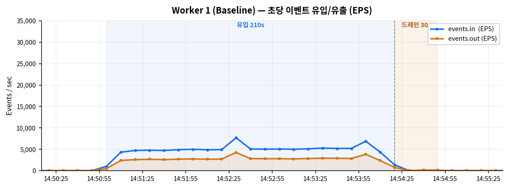

#### [Worker 4 — Multi-Thread]
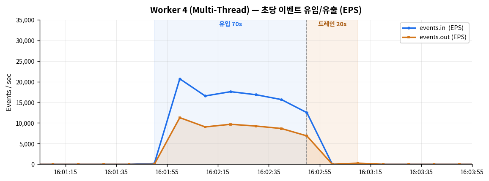

#### [Worker 8 — Max Load]
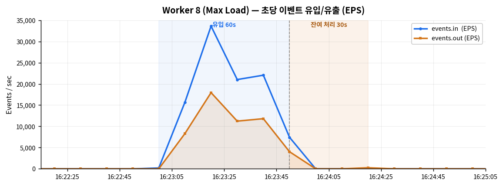

**분석 — 처음엔 "Worker 8이 효과가 없다"로 보였다**

6.1절 표만 보면 Worker 4와 8의 총 소요 시간이 90초로 똑같아서, "Worker를 8개까지 늘린 게 의미 없었다"고 오해하기 쉽다. 그런데 같은 표의 활성구간 EPS는 Worker 8이 오히려 더 높다(16,667/s vs 14,286/s) — 처리는 더 빨랐다는 건데 시간은 그대로였다는 게 앞뒤가 안 맞아 보였다.

원인은 "유입"과 "총 처리 시간"을 같은 구간으로 뭉뚱그려 보고 있었다는 데 있었다. 둘을 나눠서 다시 보면 이렇다.

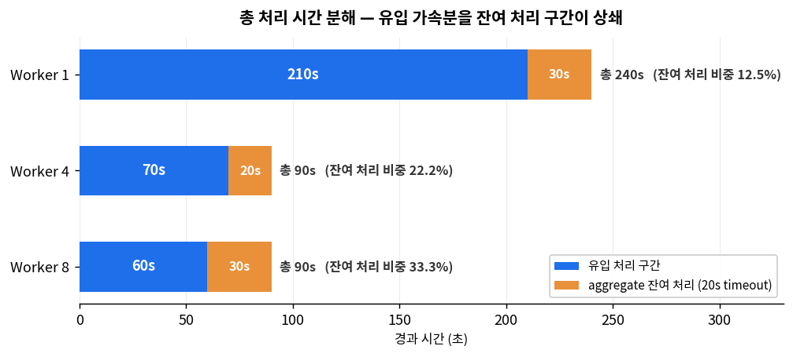

| | 유입 소요 | 배속 | 잔여 처리 | 총 시간 | 잔여 처리 비중 |
|:---:|---:|---:|---:|---:|---:|
| W1 | 210초 | 1.00× | 30초 | 240초 | 12.5 % |
| W4 | 70초 | 3.00× | 20초 | 90초 | 22.2 % |
| W8 | 60초 | 3.50× | 30초 | 90초 | 33.3 % |

나눠보니 Worker 8의 유입 자체는 실제로 더 빨랐다(70초 → 60초). 다만 유입이 끝난 뒤 aggregate 맵이 마저 내보내질 때까지 대기하는 **잔여 처리 구간**이 20초에서 30초로 늘어났고, 그 결과 총 시간은 두 경우 모두 90초로 같아졌다. 이 잔여 처리 구간은 Worker 수와 관계없이 발생하는 고정 오버헤드이므로, 유입이 빨라질수록 전체 시간에서 차지하는 비중이 커진다(12.5% → 33.3%).

왜 20초와 30초로 갈렸는지 원시 데이터를 다시 뜯어봤다. 두 케이스 모두 대부분의 유출이 끝난 뒤, 약 255건짜리 이벤트 뭉치가 뒤늦게 한 번 더 찍힌다 — 여러 key의 마지막 통계함들이 주기적으로 도는 flush에 의해 한꺼번에 정리되며 나온 값으로 보인다. 유입 시작 시점 기준으로 각 시점의 경과 시간을 다시 재보면 다음과 같다.

| | 대량 유출 종료 (경과) | 늦은 데이터 등장 (경과) | 조용한 구간 | 잔여 처리 구간 |
|:---:|---:|---:|---:|---:|
| W4 | +60초 | **+80초** | 20초 | 20초 |
| W8 | +50초 | **+80초** | 30초 | 30초 |

**늦은 데이터가 등장하는 시점이 두 케이스 모두 유입 시작 후 정확히 80초로 같다.** Worker 8은 대량 유출이 W4보다 10초 더 일찍 끝났는데(+50초 vs +60초), 늦은 데이터가 등장하는 시점은 앞당겨지지 않고 여전히 +80초였다. 그 결과 그 사이의 "조용한 구간"만 W4는 20초, W8은 30초로 늘어난 것이다. 즉 조용한 구간 자체는 의미 있는 값이 아니라, "대량 유출이 언제 끝났는가"에 따라 남는 부산물에 가깝다 — 실제로 고정된 것처럼 보이는 지점은 늦은 데이터가 등장하는 +80초 쪽이다.

다만 이 관찰은 W4와 W8 두 사례뿐이라는 한계가 있다. W1은 잔여 처리 구간이 30초로 규모 자체가 달라(총 240초), 같은 +80초 지점 패턴이 적용되는지 확인하지 못했다. 표본이 부족해 "등장 시점이 항상 80초에 고정된다"고 단정할 근거는 아직 없으며, 후속 실행으로 반복 검증이 필요한 관찰로 남겨둔다.

그런데 여기서 또 다른 의문이 남는다. Worker를 4개에서 8개로 2배 늘렸는데, 정작 유입 소요 시간은 70초 → 60초로 14%밖에 줄지 않았다. CPU나 디스크 같은 하드웨어 자원이 부족했던 걸까? 6.3절과 6.6절에서 하나씩 확인해본다.

**축소 효과:** 유출 건수는 **W1** 552,908건(44.71% 축소), **W4** 550,642건(44.94%), **W8** 535,756건(46.42%)이었다. Aggregate 병합을 통해 Elasticsearch 인덱싱 부하를 절반 가까이 줄인 셈이다.

### 6.3 CPU 사용률

#### [Worker 1]
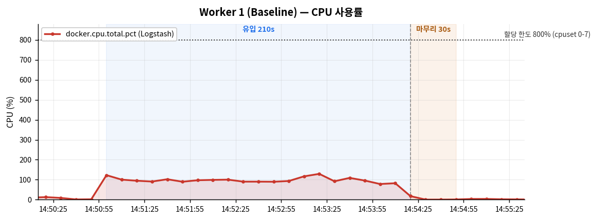

#### [Worker 4]
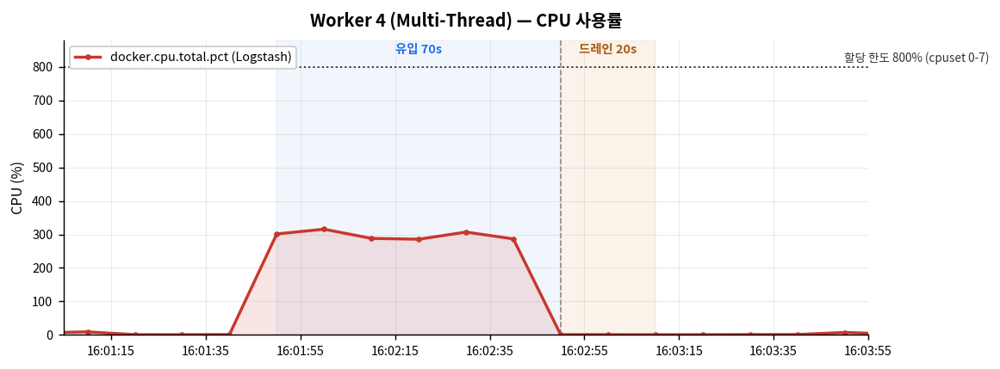

#### [Worker 8]
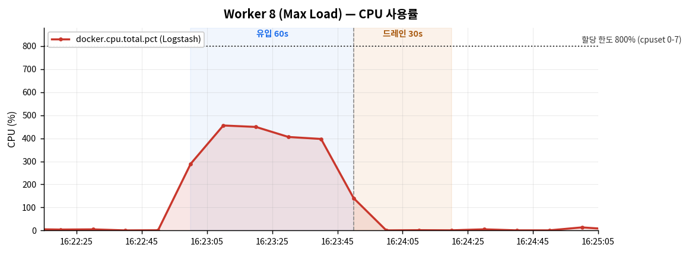

**분석 — 가장 먼저 의심한 것은 CPU 부족이었다**

Worker를 늘렸는데 처리량이 기대만큼 안 늘었다면, "CPU가 다 차서 더는 못 빨라진 것"이 가장 먼저 떠오르는 설명이다. 이걸 확인하기 위해 CPU 그래프부터 봤다.

세 케이스 모두 유입 시작과 동시에 CPU가 올라가고, 유입 종료 시 즉시 내려가는 깔끔한 형태였다. 측정 구간에 기동 부하 등 잡음이 섞이지 않았음을 볼 수 있다.

Worker 8의 최대 CPU는 455.60%로, 할당된 8코어(800%)의 57%에 불과했다. **CPU 자원이 절반 넘게 남아 있었다는 뜻이라, "CPU가 부족해서 못 빨라졌다"는 가설은 틀렸다.**

**그럼 CPU가 남는데 왜 안 빨라졌을까.** 워커 1개가 실제로 CPU를 얼마나 쓰는지 나눠서 계산해봤다.

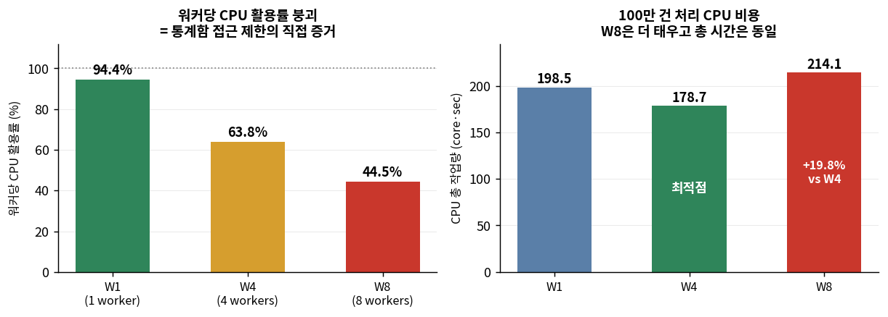

| | 유입구간 평균 CPU | 코어 환산 | 워커당 활용률 |
|:---:|---:|---:|---:|
| W1 | 94.42 % | 0.94 core | 94.4 % |
| W4 | 255.04 % | 2.55 core | 63.8 % |
| W8 | 356.26 % | 3.56 core | 44.5 % |

Worker 1은 1개 코어를 거의 100% 쓰고 있다. 반면 Worker 8은 코어 8개를 할당받았지만 3.56개만 사용했다. **CPU가 남는데도 워커 하나하나가 자기 몫을 다 못 쓰고 있다는 건, 워커들이 CPU를 기다리는 게 아니라 서로를 기다리고 있다는 뜻이다.** 실제로 aggregate 맵은 한 번에 한 워커만 접근할 수 있게 막혀 있어서(8.1절), 나머지 워커는 그 순간 CPU가 남아돌아도 할 일이 없어 대기한다. 여기서 처음으로 병목의 정체가 하드웨어가 아니라 aggregate 필터 자체의 구조라는 게 드러났다.

**CPU 총 작업량**을 보면, 100만 건을 처리하는 데 필요한 CPU 총량은 Worker 수와 크게 관계없지만, W8은 W4보다 19.8% 더 소모하면서 총 처리 시간은 0% 개선했다. CPU 효율 관점에서 **W4가 가장 경제적**이었다.

CPU는 병목이 아니라는 게 확인됐지만, 아직 디스크는 확인하지 못했다. 6.6절에서 이어서 살펴본다.

### 6.4 컨테이너 메모리

#### [Worker 1 — Avg: 1,896.6 MB (23.14%)]
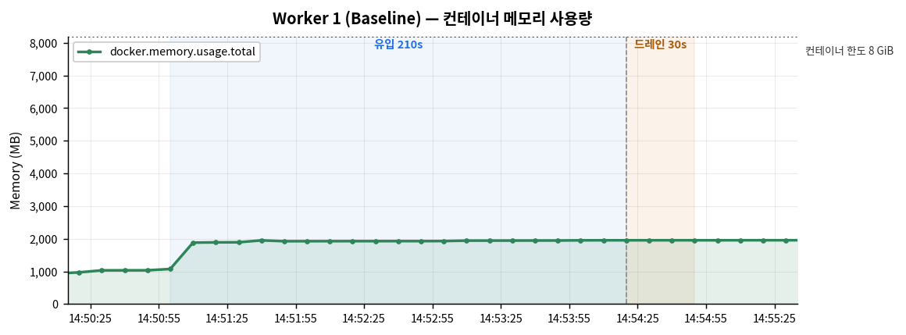

#### [Worker 4 — Avg: 1,874.0 MB (22.86%)]
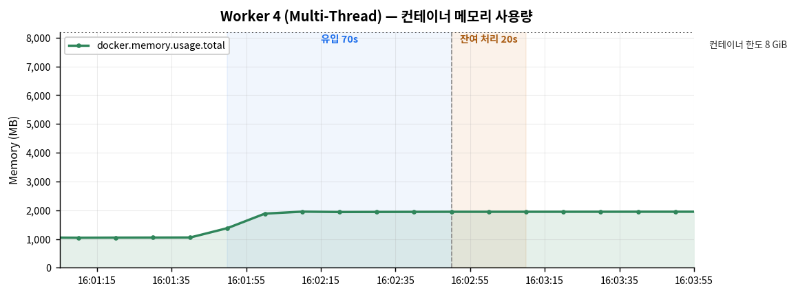

#### [Worker 8 — Avg: 1,923.4 MB (23.47%)]
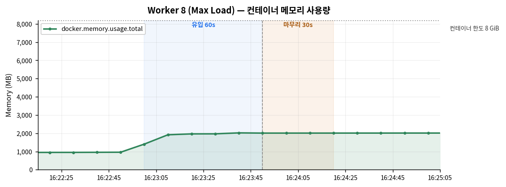

**분석**

3개 케이스 모두 1,874~1,923 MB(22.9~23.5%) 범위에서 평탄한 수평선을 그렸다. Worker를 8배 늘려도 메모리는 2.6%만 증가했는데, 이는 Logstash의 워커가 프로세스가 아니라 **스레드**이므로 힙을 공유하기 때문이다. 메모리 누수는 관측되지 않았다.

사용률 백분율의 분모는 `deploy.resources.limits.memory: 8G`이며, CSV에서 `usage.total / usage.pct`를 역산한 결과 8.004 GiB로 설정값과 일치함을 확인하였다.

### 6.5 JVM Heap

#### [Worker 1 — Avg: 860.7 MB / Max: 1,321.9 MB]
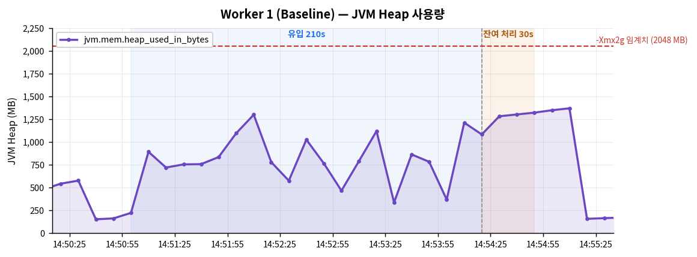

#### [Worker 4 — Avg: 791.0 MB / Max: 1,055.4 MB]
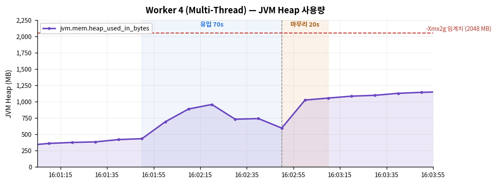

#### [Worker 8 — Avg: 1,005.7 MB / Max: 1,279.6 MB]
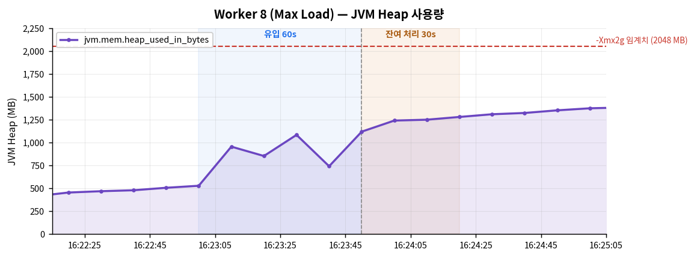

**분석**

JVM Heap은 평균 791~1,006 MB, 최대 1,055~1,322 MB로, `-Xmx2g`(2,048 MB)의 51~65% 수준이었다.

- W8에서 평균이 가장 높은 것은(1,006 MB), 8개 워커가 동시에 배치를 보유하면서 아직 처리가 끝나지 않은 객체가 많아진 결과로 보인다.
- W1에서 최대가 가장 높은 것은(1,322 MB), 처리 시간이 210초로 길어 동시에 살아있는 aggregate 맵의 수명이 길었기 때문으로 추정된다.
- 어느 케이스도 임계치에 가까이 가지 않았다. 톱니 패턴이 안정적이어서 GC가 정상 작동한 것으로 판단된다.

### 6.6 Disk I/O

#### [Worker 1 — Read Peak: 4.00 MB/s]
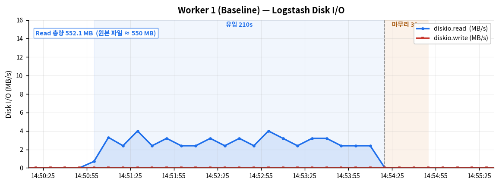

#### [Worker 4 — Read Peak: 13.60 MB/s]
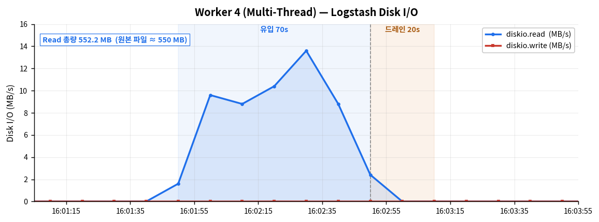

#### [Worker 8 — Read Peak: 12.80 MB/s]
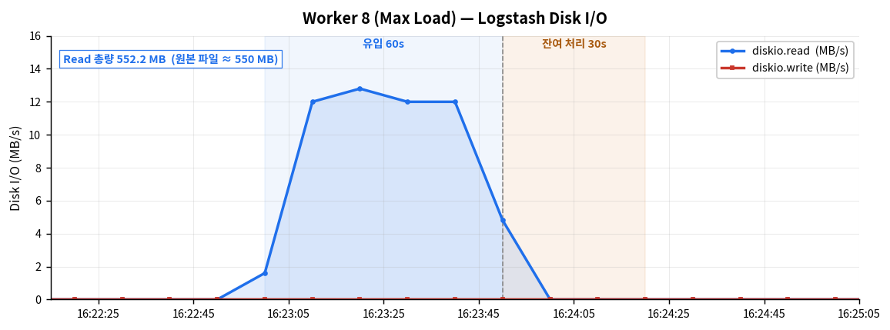

#### Elasticsearch — Disk Write & CPU
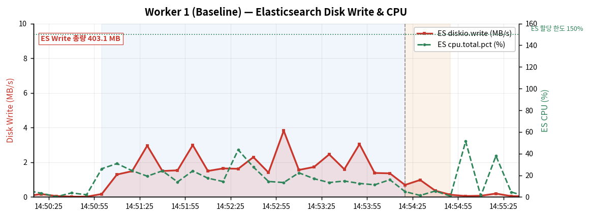
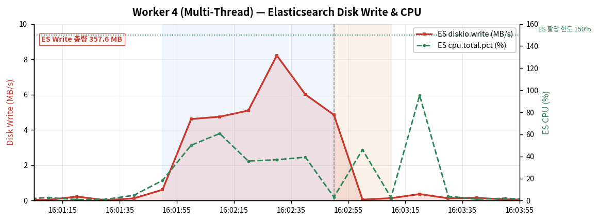
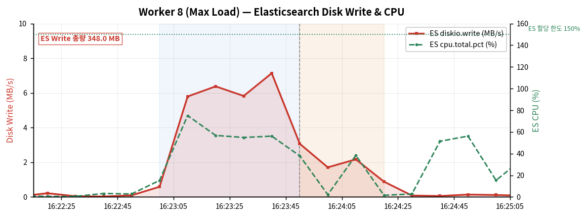

**분석 — 남은 가능성, 디스크도 확인해봤다**

CPU는 6.3절에서 병목이 아니라고 확인됐다. 남은 하드웨어 후보는 디스크였다.

**Read:** 3개 케이스의 Read 총량이 모두 552 MB로 원본 파일 크기와 일치하여, 4.2절의 캐시 초기화가 정상 작동했음을 확인하였다. Peak는 **W1** 4 MB/s → **W4** 13.6 MB/s → **W8** 12.8 MB/s로 변화했다.

13 MB/s만 보면 디스크가 한계에 다다른 것처럼 보일 수 있지만, NVMe M.2 SSD의 순차 읽기는 수천 MB/s급이다. 13 MB/s는 그 1% 수준에 불과해, **디스크도 병목이 아니었다.**

**Write (Logstash):** 전 구간 0 MB/s로, Logstash가 데이터를 메모리에서 처리한 뒤 네트워크로 전송하기 때문이다(Persistent Queue 미사용). 단, 이를 **스택 전체의 쓰기 부하가 없다고 해석해서는 안 된다.** 같은 구간에 Elasticsearch는 348~403 MB를 기록했다(translog + segment). 쓰기 부하는 Logstash가 아니라 Elasticsearch에서 발생하는 것이며, 본 측정 범위가 Logstash 컨테이너였기에 0으로 관측된 것이다.

**ES CPU:** 평균 14.5~23.2%, 최대 95.4%로, 할당 한도(1.5 core = 150%)에 비해 여유가 있었다. Elasticsearch가 처리량의 병목이 되지는 않은 것으로 판단한다.

**결국 CPU도, 디스크도, Elasticsearch도 병목이 아니었다.** 6.3절에서 확인한 워커당 CPU 활용률 붕괴가 유일한 단서였고, 이는 하드웨어가 아니라 aggregate 필터 자체의 구조(맵을 한 번에 한 워커만 쓸 수 있는 제약)에서 비롯된 것이었다 — 자세한 원리는 8장에서 다룬다.

---

## 7. Aggregate 정합성 검증

### 7.1 In / Out / Sum 검증

과제 요구사항: *"agg 적용된 결과의 경우 out count는 축소되고, sum 집계 count 는 동일해야함"*

| 단계 | 항목 | Worker 1 | Worker 4 | Worker 8 |
|:---:|---|---:|---:|---:|
| 1 | 원본 방화벽 로그 (tar -xJf 검증) | 1,000,000 | 1,000,000 | 1,000,000 |
| 2 | In Data Count (events.in, tar 포함) | 1,000,003 | 1,000,003 | 1,000,003 |
| 2-1 | ㄴ 형식 검증 실패 → 격리 (5.2절) | 4 | 4 | 4 |
| 2-2 | ㄴ Aggregate 파이프라인 유입 | 999,999 | 999,999 | 999,999 |
| 3 | **Out Data Count (events.out)** | **552,908** | **550,642** | **535,756** |
| 4 | **sum(event_count)** | **999,999** ✅ | **999,999** ✅ | **999,999** ✅ |
| 5 | 축소율 | 44.71% | 44.94% | 46.42% |

> Out Data Count = Agg 윈도우 수 + 격리 4건

| 검증 항목 | 결과 |
|---|:---:|
| out count 축소 | ✅ 999,999 → 552,904 ~ 535,752 (44.7~46.4%) |
| sum 집계 count 동일 | ✅ 999,999로 3케이스 전부 일치 |
| 파싱 오류 | ✅ dissect/kv/date 실패 0건 |

`events.out`에는 `file` 출력으로 격리된 4건이 포함되어 있으므로, 순수 aggregate 윈도우 수는 `events.out − 4`이다.

Worker 수가 달라져도 sum이 보존되는 이유는, `aggregate` 필터의 `map['event_count'] += 1` 연산이 mutex로 보호되는 구간에서 수행되기 때문이다. 덧셈의 원자성이 보장되므로 **총량은 유지되지만, 그 총량이 어떤 윈도우에 얼마씩 담기는지(= 경계)는 Worker 수에 따라 달라진다** — 이것이 7.2절의 내용이다.

### 7.2 윈도우 이벤트 밀도 분포

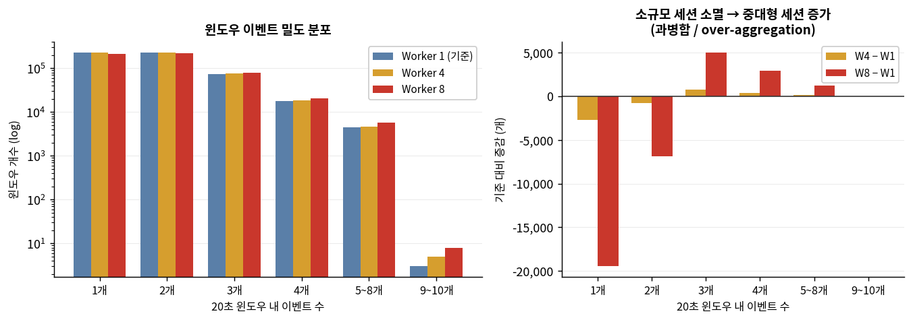

| 윈도우 내 이벤트 수 | **Worker 1** | **Worker 4** | **Worker 8** | 증감 (W1→W4 / W1→W8) |
|:---:|---:|---:|---:|---:|
| 1개 | 230,526 | 227,838 | 211,073 | −2,688 / −19,453 |
| 2개 | 225,463 | 224,678 | 218,600 | −785 / −6,863 |
| 3개 | 74,550 | 75,275 | 79,574 | +725 / +5,024 |
| 4개 | 17,902 | 18,250 | 20,834 | +348 / +2,932 |
| 5~8개 | 4,460 | 4,596 | 5,667 | +136 / +1,207 |
| 9~10개 | 3 | 5 | 8 | +2 / +5 |
| **총 윈도우 수** | **552,904** | **550,638** | **535,752** | −2,266 / −17,152 |

Worker 수가 늘어날수록 **소규모 윈도우(1~2개)가 줄고, 중대형 윈도우(3개 이상)가 늘어나는** 패턴이 나타났다. W8에서는 1~2개짜리가 약 26,300개 줄고, 3개 이상이 약 9,200개 늘었다.

**왜 이런 일이 생기는가**

`timeout_timestamp_field` 설정 시, aggregate 필터는 **처리 중인 이벤트의 timestamp를 기준 시계로 사용**하여 맵의 만료를 판정한다.

- Worker 1에서는 `file` input이 파일을 순서대로 읽고 단일 워커가 처리하므로, 기준 시계가 순서대로 흐른다.
- Worker 4·8에서는 이벤트가 배치 단위로 여러 워커에 분배되면서 처리 순서가 섞인다. 앞선 timestamp를 가진 이벤트가 늦게 처리되면 기준 시계가 뒤로 밀리고, 만료되었어야 할 맵이 계속 살아남아 다음 이벤트까지 흡수하게 된다.

이것이 "총 윈도우 수 감소 + 윈도우당 밀도 증가"로 나타나는 것이고, aggregate 필터 공식 문서에서 **Worker를 1로 고정하라고 권고하는 근거**이기도 하다.

**보안 운영 관점:** 20초 안에 로그가 몇 건 몰려있는지(event_count)는 포트 스캔이나 브루트포스 같은 공격을 구분하는 데 쓰일 수 있다. 정상적인 접속은 20초 안에 보통 한두 건이지만, 공격은 짧은 시간에 반복적으로 시도하기 때문에 이 값이 크게 나오는 경우가 많다. 그런데 Worker를 늘리면 이 값 자체가 실제 트래픽과 다르게 왜곡될 수 있으므로, 이 값의 정확도가 중요한 환경에서는 Worker 1로 운영하는 것이 안전하다.

### 7.3 제출 결과물 검증

`3_aggregate_output/firewall_agg_result.csv.gz` (Worker 1 기준)을 직접 열어 검증하였다.

**기본 정합성**

| 검증 항목 | 값 | 판정 |
|---|---:|:---:|
| 레코드 수 | 552,904 (= `events.out` − 격리 4건) | ✅ |
| `sum(event_count)` | 999,999 | ✅ |
| `sum(sum_bytes_total)` | 99,999,900 | ✅ |
| `sum(sum_packets_total)` | 999,999 | ✅ |
| 고유 key 수 (3-tuple) | 2,550 | — |
| `max(event_count)` | 10 | ✅ |

**"20초 타임아웃이 실제로 지켜졌는가" 검증 시도**

결과 파일만으로 이것도 확인하고 싶어서 두 가지 방법을 시도했지만, 둘 다 유효한 검증이 아니었다.

| 시도 | 측정 방법 | 결과 | 무효로 판단한 이유 |
|:---:|---|---|---|
| 1차 | 윈도우별 세션 길이 (`last_end_time − first_start_time`) | 음수 55%+ | 이 필드는 로그 자체의 연결 시작·종료 시각이지, aggregate가 윈도우를 연/닫은 시각이 아니었다 |
| 2차 | 같은 key의 연속 윈도우 간 시간 간격 | 552,904건 중 2,719건(0.49%) 초과 | key가 한동안 조용했다가 다시 나타나 간격이 벌어지는 건 정상 동작이지, 타임아웃 오류가 아니었다 |

**결론:** aggregate가 실제 판정에 쓰는 기준값(`@timestamp`)은 이 결과 파일에 남아있지 않다. `first_start_time`/`last_end_time`은 로그 자체의 속성일 뿐, 윈도우가 언제 열리고 닫혔는지와는 무관하다. 따라서 **현재 제출 결과물만으로는 20초 타임아웃의 정확한 준수 여부를 검증할 수 없다.** 검증하려면 aggregate `code` 블록에 `map['window_open_at'] ||= event.get('@timestamp')`처럼 판정 기준값을 별도 필드로 함께 기록하도록 파이프라인을 수정한 뒤 재실행해야 하며, 후속 개선 과제로 남긴다.

---

## 8. Aggregate Filter 작동 원리와 한계

### 8.1 작동 원리

| 단계 | 동작 |
|:---:|---|
| 1 | 이벤트가 들어오면 `task_id` 표현식을 평가하여 병합 키를 산출한다. |
| 2 | 해당 키의 맵이 없으면 새로 생성하고, 있으면 기존 맵을 가져온다. 맵은 `@@aggregate_maps`라는 파이프라인 레벨 클래스 변수에 저장된다. |
| 3 | Ruby `code` 블록이 실행되어 맵 내용을 갱신한다. 이 과정에서 맵에 대한 접근은 **mutex로 보호**되어 여러 워커가 동시에 접근할 수 없다. |
| 4 | `timeout_timestamp_field`가 설정된 경우, 현재 처리 중인 이벤트의 timestamp를 기준으로 맵 생성 시각으로부터 timeout초가 경과했는지 판정한다. |
| 5 | 만료된 맵은 제거되며, `push_map_as_event_on_timeout => true`에 의해 통계 이벤트로 변환된다. |
| 6 | `aggregate_maps_path`를 설정하지 않으면, Logstash 종료 시 남아있는 맵은 사라진다. |

### 8.2 한계

| # | 한계 | 설명 |
|:---:|---|---|
| 1 | **Worker 1 고정 필요** | 공식 문서에서 aggregate 필터 사용 시 filter workers를 1로 설정하도록 명시하고 있다. 본 보고서 7.2절의 밀도 분포 왜곡이 이를 실측으로 확인한 것이다. |
| 2 | **처리량 상한** | 통계함(map)은 한 번에 한 워커만 쓸 수 있게 막혀 있으므로, Worker를 늘려도 aggregate 구간은 순서대로 실행된다. 6.3절에서 워커당 CPU 활용률이 94% → 64% → 45%로 떨어진 것이 이를 보여준다. |
| 3 | **잔여 처리 오버헤드** | 마지막 이벤트 이후 잔여 맵이 내보내지기까지 timeout + 내보내는 주기만큼의 대기 시간이 발생한다. 본 테스트에서는 20~30초로 측정되었다. |
| 4 | **수평 확장 불가** | 맵이 단일 JVM 힙에 존재하므로, Logstash를 여러 대로 늘리면 같은 key가 서로 다른 인스턴스로 분산되어 병합이 깨진다. |
| 5 | **메모리 제약** | 동시에 살아있는 key 수에 비례해 힙을 사용한다. 본 테스트의 key 수(2,550개)는 적은 편이지만, 실 운영에서 key가 대폭 늘어나면 OOM 위험이 있다. |
| 6 | **상태 유실** | 장애나 재시작 시 잔여 맵이 소실된다. `aggregate_maps_path`로 파일에 저장할 수 있으나, 파이프라인당 aggregate 1개 제한이 있다. |
| 7 | **Late event 처리 수단 없음** | Flink나 Spark의 watermark처럼 늦게 도착한 이벤트를 정의하고 처리하는 메커니즘이 없다. 7.2절의 왜곡도 이 부재에서 비롯된 것이다. |

> 참고: Elastic 공식 문서 — Aggregate filter plugin
> https://www.elastic.co/docs/reference/logstash/plugins/plugins-filters-aggregate

---

## 9. Logstash 대체 ETL 서비스 검토

### 9.1 검토 배경

본 벤치마크에서 확인된 aggregate 필터의 주요 제약은 다음과 같다.

- Worker를 1로 고정해야 하므로, 단일 인스턴스의 처리량이 약 4,700 EPS에 묶인다.
- 맵이 로컬 힙에 있어서 수평 확장이 어렵다.
- 지연 이벤트에 대한 처리 수단이 없다.

일일 수억 건 규모를 감당하려면 단순 계산으로도 최소 3대 이상이 필요하지만, 키가 분산되면 병합이 깨진다. 따라서 **키 기반으로 이벤트를 분배하면서 각 파티션 내에서 순서를 보장할 수 있는 구조**가 필요하다.

### 9.2 후보 비교

| 후보 | 시간 처리 정확도 | 구현 편의성 | 확장성 | 장애 복구 | 자원 효율 |
|---|:---:|:---:|:---:|:---:|:---:|
| **Kafka + Flink** | ◎ | ◎ | ◎ | ◎ | ○ |
| Kafka + Kafka Streams | ◎ | ○ | ◎ | ◎ | ○ |
| Kafka + Spark | ○ | ○ | ◎ | ◎ | △ |
| Vector (Rust 기반) | △ | ◎ | ○ | △ | ◎ |
| Fluent Bit | △ | ◎ | ○ | △ | ◎ |

**Kafka + Flink를 선택한 이유:** 나머지 항목은 Kafka Streams와 동일하지만, **구현 편의성**에서 갈린다.

| | Kafka Streams | Flink |
|---|---|---|
| 윈도우·지연 처리 | 라이브러리라 직접 구현 필요 | 엔진에 내장 |
| 입력 소스 | Kafka 전용 | 다양한 소스 지원 |
| 운영 | 애플리케이션을 직접 관리 | 클러스터가 분산·재시작 관리 |

지금 로직(20초 윈도우 + 3-tuple 키 + 다중 필드 합산) 수준에서는 이 차이가 구현 난이도와 운영 부담으로 바로 이어지므로 Flink를 우선 후보로 선정하였다.

**나머지 후보를 제외한 이유**

- **Kafka + Spark:** 마이크로배치 구조(수 초 단위로 묶어 처리)라 완전한 실시간이 아니고, 배치마다 상태를 다시 계산하는 방식이라 자원도 더 무겁다
- **Vector:** event-time 기반의 정밀한 시각 처리 기능이 없어서, 20초 윈도우처럼 정확한 시간 처리에는 약하다
- **Fluent Bit:** 집계 기능 없이 로그 전달에만 특화된 도구라, aggregate 대체 용도로는 애초에 적합하지 않다

### 9.3 제안: Kafka + Flink 구조

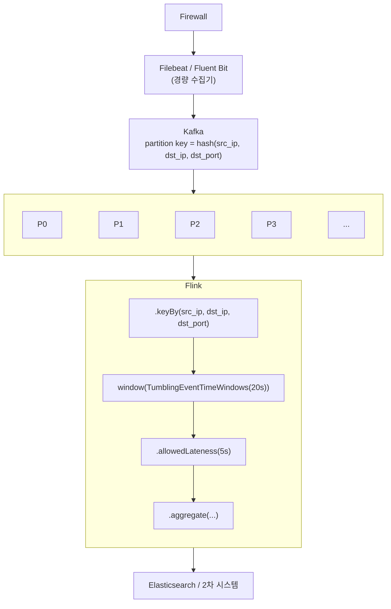

이 구조에서 순서 뒤섞임 문제를 실제로 해결하는 것은 **Flink의 watermark**다. Flink는 "이 시각까지의 데이터는 다 도착한 것으로 본다"는 기준을 명시적으로 관리하기 때문에, 이벤트가 도착하는 순서와 무관하게 각 이벤트를 자신의 시각에 맞는 윈도우에 정확히 배치한다. Logstash가 "방금 처리한 이벤트의 시각"만 보고 판정하다가 순서가 섞이면 오판했던 것과 다른 지점이다. 늦게 도착한 이벤트도 `allowedLateness` 범위 안이면 정상 반영되므로, 8.2절 한계 #7이 해결된다.

**Kafka를 함께 둔 이유:** 순서 정확도만 보면 Flink는 파일을 직접 읽어 Kafka 없이도 동작할 수 있다. 그럼에도 Kafka를 앞단에 둔 것은 다음 세 가지 때문이다.

- **유실 방지:** 방화벽 로그는 사고 조사·감사에 쓰이므로 유실이 허용되지 않는다. Flink가 처리 중 장애가 나도 Kafka에 남아있는 데이터로 재처리할 수 있다.
- **속도 분리:** 일일 수억 건 규모에서는 유입이 순간적으로 몰릴 수 있다. Kafka가 완충 역할을 해, 그 순간 Flink 처리가 못 따라가도 데이터가 밀리지 않고 대기한다.
- **키 기반 분산:** 3-tuple을 파티션 키로 써서, 같은 key의 이벤트를 항상 같은 파티션으로 보낸다. 이는 순서를 만드는 것이 아니라 Flink의 각 처리기가 자신이 맡은 key 집합만 다루도록 상태를 나누는 역할이다.

### 9.4 단계별 전환 제안

| 단계 | 조치 | 효과 | 고려사항 |
|:---:|---|---|---|
| 1 | Logstash `pipeline.workers=1` 고정 | 정합성 확보 | 처리량 상한 유지 |
| 2 | 3-tuple 해시 기준으로 N개 파이프라인 분할 (각 `-w 1`) | Logstash 유지한 채 N배 확장 | 운영 복잡도 증가 |
| 3 | Kafka 도입, Logstash를 Kafka consumer로 전환 | 버퍼링·재처리 가능 | 인프라 추가 필요 |
| 4 | 집계 로직을 Flink로 이관 | exactly-once + 선형 확장 | Flink 운영 역량 필요 |

---

## 10. 결론

### 10.1 핵심 결론 — Worker 증설의 진짜 위험은 속도가 아니라 데이터 정합성이다

본 벤치마크에서 가장 중요하게 봐야 할 결과는 처리 속도가 아니라, **Worker를 늘릴수록 aggregate 결과의 정합성이 깨진다는 사실**이다.

7.2절에서 확인했듯, Worker를 1 → 4 → 8로 늘리자 20초 윈도우에 몇 건의 이벤트가 뭉치는지의 분포 자체가 달라졌다. 1~2개짜리 소규모 윈도우가 줄어들고 3개 이상의 윈도우가 늘어나는 방향으로, 원래 서로 다른 시점에 따로 집계됐어야 할 이벤트들이 잘못 뭉쳐지는 현상이 실측으로 확인되었다. `sum(event_count)` 같은 총량은 mutex로 보호되어 항상 보존되지만, **그 총량이 어느 윈도우에 얼마씩 담기는지는 Worker 수에 따라 달라진다.**

이 문제가 성능 이슈보다 더 심각한 이유는, **aggregate 필터를 쓰는 목적 자체가 "20초 단위의 정확한 통계"이기 때문**이다. 처리가 느린 건 시간을 더 기다리면 해결되지만, 통계가 부정확한 건 몇 번을 다시 돌려도 매번 다른 결과가 나올 수 있어 신뢰할 수 없는 데이터가 계속 쌓인다는 뜻이다. 방화벽 로그 맥락에서는 이 왜곡이 포트 스캔·브루트포스 탐지 같은 보안 판단의 기준값 자체를 흔들 수 있다(7.2절).

**Elastic 공식 문서가 aggregate 필터 사용 시 `pipeline.workers=1`을 명시적으로 요구하는 이유가 바로 이것이다.** 본 벤치마크는 그 근거를 정량적으로 재현했다.

### 10.2 참고 — Worker 증설의 성능 효과와 한계

정합성 문제와는 별개로, 성능 측면에서도 Worker 증설의 효과는 기대만큼 크지 않았다.

Worker 1 → 4에서 총 처리 시간이 240초 → 90초로 **62.5% 단축**되었다. 하지만 Worker 4 → 8에서는 총 처리 시간이 같은 90초로, 추가 개선이 없었다.

하드웨어 자원은 어느 것도 한계에 도달하지 않았다.

| 자원 | Worker 8 실측 | 할당 한도 | 사용률 |
|---|---:|---:|---:|
| CPU | 3.56 core (유입구간 평균) | 8 core | 44.5 % |
| Disk Read | 12.80 MB/s | NVMe (수천 MB/s) | 1% 미만 |
| Memory | 2,020.8 MB | 8 GB | 24.7 % |
| JVM Heap | 1,279.6 MB | 2 GB | 62.5 % |

처리량이 정체된 원인은 두 가지로 정리할 수 있다.

1. **통계함(map)을 한 번에 하나씩만 쓸 수 있는 구조:** 워커당 CPU 활용률이 94.4% → 63.8% → 44.5%로 떨어진 것에서 확인할 수 있다. Worker를 늘려도 aggregate 맵은 한 번에 하나의 워커만 접근할 수 있으므로, 나머지는 대기하게 된다.
2. **잔여 처리 구간의 고정 오버헤드:** 유입이 끝난 뒤 잔여 맵이 내보내지기까지 20~30초의 대기 시간이 발생하며, 이는 Worker 수와 무관하다. 전체 시간에서 차지하는 비중이 12.5% → 22.2% → 33.3%로 커지면서 유입 가속분을 상쇄한다.

**즉 Worker를 늘려서 얻는 성능 이득은 처음부터 크지 않았고(4개 이후 정체), 그마저도 정합성을 희생한 대가였다** — 성능상 밑지는 장사인데 정합성까지 깨지는 셈이라, Worker 증설을 택할 이유가 이중으로 없다.

### 10.3 Aggregate 필터의 효과

20초 윈도우 통계 병합을 통해 원본 999,999건을 552,904 ~ 535,752건으로 **약 44.7~46.4% 축소**하였다. `sum(event_count)`는 3개 케이스 모두 999,999로 동일하게 보존되어, 데이터 유실 없이 저장 효율을 높일 수 있음을 확인하였다.

### 10.4 제언

Logstash aggregate 필터를 사용하는 시간 기반 통계 파이프라인에서는, 공식 문서의 권고대로 **`pipeline.workers=1`로 운영하는 것이 안전하다.** 이는 성능을 일부 포기하는 선택이 아니라, 10.1절에서 확인한 정합성 훼손을 막기 위한 필수 조건이다.

처리량이 부족한 경우, Worker 증설이 아니라 **키 기반 샤딩을 통한 수평 확장**(9.4절 2단계)이 정합성을 유지하면서 처리량을 늘리는 방법이다. 장기적으로는 Kafka + Flink 구조로 전환하면, 순서 보장과 수평 확장을 구조적으로 양립시킬 수 있다.
